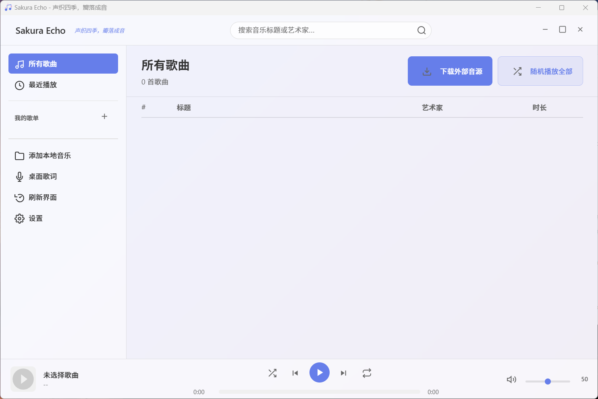

# Sakura Echo 🌸

> 一款简洁优雅的 Bilibili 音乐下载与播放工具 - 声织四季，瓣落成音




---

## ✨ 功能特性

### 🎵 音乐播放
- **高质量音频播放** - 支持多种音频格式
- **多种播放模式** - 顺序、倒序、随机、单曲循环
- **音量控制** - 精确的音量调节和静音功能
- **进度控制** - 可拖拽的进度条，自由跳转

### 📺 Bilibili 视频下载
- **视频转音频** - 从 Bilibili 视频提取高质量音频
- **智能下载** - 自动选择最佳音质
- **内置工具** - 内置 yt-dlp 和 ffmpeg，开箱即用
- **批量下载** - 支持连续下载多个视频

### 📂 歌单管理
- **创建歌单** - 创建自定义歌单，灵活分类管理
- **歌单编辑** - 重命名歌单、添加/移除歌曲
- **歌曲管理** - 在不同歌单间移动歌曲
- **计数显示** - 实时显示歌单中歌曲数量

### 🎚️ 音量同步
- **自动音量平衡** - 使用 EBU R128 算法分析歌曲响度
- **统一听感** - 自动调整音量增益，避免歌曲间音量差异
- **批量处理** - 一键同步所有歌曲音量
- **可调节目标** - 支持自定义目标响度（-24 到 -12 LUFS）

### 💾 本地音乐
- **文件导入** - 导入本地音乐文件
- **目录扫描** - 批量扫描目录添加音乐
- **元数据提取** - 自动提取歌曲标题、艺术家等信息

---

## 📥 下载安装

### 方式一：直接下载（推荐）

访问 [GitHub Releases](https://github.com/xuzhili835/MusicPlayer/releases) 下载最新版本

- **Sakura Echo Setup 1.1.3.exe** - 安装版（推荐）
- **Sakura Echo-1.1.3-win.zip** - 便携版

### 方式二：从源码构建

```bash
# 克隆仓库
git clone https://github.com/xuzhili835/MusicPlayer.git
cd MusicPlayer

# 安装依赖
npm install

# 运行开发版本
npm run dev

# 构建生产版本
npm run build
```

---

## 🚀 快速开始

### 系统要求
- **操作系统**: Windows 10+
- **内存**: 至少 512MB RAM
- **存储**: 500MB 可用空间

### 首次使用
1. **启动应用** - 双击桌面图标或从开始菜单启动
2. **添加音乐** - 通过以下方式添加音乐：
   - 粘贴 Bilibili 视频链接进行下载
   - 点击"添加本地音乐"导入本地文件
3. **创建歌单** - 右键侧边栏创建自定义歌单
4. **开始享受** - 双击歌曲开始播放

### Bilibili 视频下载
1. **复制视频链接** - 复制 Bilibili 视频链接（支持 b23.tv 短链接和完整 URL）
2. **在应用中下载** - 点击应用中的下载按钮
3. **粘贴并确认** - 粘贴链接并点击确认
4. **自动处理** - 应用将自动下载视频并转换为音频格式
5. **自动添加** - 转换完成后歌曲将自动添加到音乐库

### 歌单管理
- **创建歌单** - 右键侧边栏空白处选择"创建歌单"
- **添加歌曲** - 右键歌曲选择"添加到歌单"
- **编辑歌单** - 右键歌单可进行重命名、删除等操作
- **修改歌曲信息** - 右键歌曲可编辑标题和艺术家信息

---

## 💡 使用提示

- **音量同步功能** - 建议使用"批量同步音量"功能，让所有歌曲音量保持一致
- **歌曲信息编辑** - Bilibili 视频标题通常与实际歌曲名称不符，建议右键编辑标题和艺术家
- **歌词下载** - 下载视频时会自动尝试下载歌词，如无歌词会有短暂提示
- **快捷键** - 支持空格键播放/暂停，方向键切换歌曲

---

## 🛠️ 技术栈

- **框架**: [Electron](https://electronjs.org/) - 跨平台桌面应用框架
- **前端**: HTML5 + CSS3 + JavaScript
- **数据库**: [SQLite](https://www.sqlite.org/) - 轻量级本地数据库
- **音频处理**: HTML5 Audio API
- **下载工具**: [yt-dlp](https://github.com/yt-dlp/yt-dlp) - 视频下载工具
- **音频转换**: [FFmpeg](https://ffmpeg.org/) - 多媒体处理工具

---

## 📁 项目结构

```
MusicPlayer/
├── main.js                 # Electron 主进程
├── renderer.js             # 渲染进程逻辑
├── preload.js              # 预加载脚本
├── index.html              # 主界面
├── styles.css              # 样式文件
├── database.js             # 数据库操作
├── lyrics.js               # 歌词处理
├── tools-manager.js        # 工具管理
├── bin/                    # 外部工具 (yt-dlp, ffmpeg)
├── build/                  # 构建资源
├── music/                  # 音乐文件存储
├── lyrics/                 # 歌词文件存储
├── thumbnails/             # 缩略图存储
└── package.json            # 项目配置
```

---

## ❓ 常见问题

**Q: 下载的音频质量如何？**
A: 应用会自动选择 Bilibili 提供的最高音质进行下载，通常为 128kbps 或更高。

**Q: 支持哪些音频格式？**
A: 主要支持 MP3 格式，同时支持导入常见的音频格式如 WAV、FLAC 等。

**Q: 如何备份我的歌单？**
A: 歌单数据存储在用户数据目录的 `music.db` 文件中，备份此文件即可保存所有歌单信息。

**Q: 需要单独安装 yt-dlp 和 ffmpeg 吗？**
A: 不需要，应用内置了 yt-dlp 和 ffmpeg 工具，开箱即用。

**Q: 音量同步是什么？**
A: 音量同步功能使用 EBU R128 算法分析每首歌曲的响度，并自动调整音量增益，让所有歌曲播放时的音量保持一致，提升听感。

---

## 📄 开源协议

本项目基于 **MIT 许可证**开源 - 查看 [LICENSE](LICENSE) 文件了解详情。

---

## 🙏 致谢

- [Electron](https://electronjs.org/) - 跨平台桌面应用框架
- [yt-dlp](https://github.com/yt-dlp/yt-dlp) - 强大的视频下载工具
- [FFmpeg](https://ffmpeg.org/) - 优秀的多媒体处理工具

---

<div align="center">

**如果这个项目对你有帮助，请给个 ⭐ 支持一下！**

Made with ❤️ by [xuzhili835](https://github.com/xuzhili835)

**Sakura Echo - 声织四季，瓣落成音** 🌸

</div>
